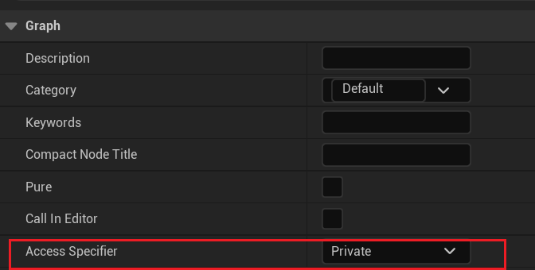
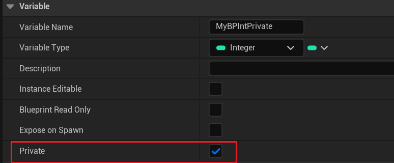

# BlueprintPrivate

- **功能描述：** 指定该函数或属性只能在本类中被调用或读写，类似C++中的private的作用域限制。不可在别的蓝图类里访问。
- **使用位置：** UFUNCTION, UPROPERTY
- **元数据类型：** bool
- **关联项：** [BlueprintProtected](#Meta_Blueprint_BlueprintProtected)
- **常用程度：** ★★

在函数细节面板上可以设置函数的访问权限：

造成的结果就是在函数上增加BlueprintPrivate=“true”

在细节面板上可以设置属性的

结果也是在属性上增加BlueprintPrivate=“true”