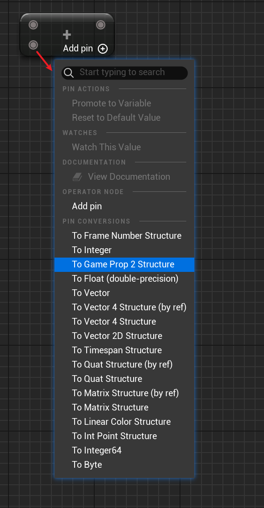

# IgnoreTypePromotion

- **功能描述：** 标记该函数不收录进类型提升函数库
- **使用位置：** UFUNCTION
- **引擎模块：** Blueprint
- **元数据类型：** bool
- **限制类型：** UBlueprintFunctionLibrary内的BlueprintPure，以OP_XXX形式的函数
- **常用程度：** ★★

标记该函数不收录进类型提升函数库。

## 这里有三个关键点：

一是该函数是什么类型？或者说一个类型提升函数是什么类型？根据IsPromotableFunction源码定义，该函数必须定义在UBlueprintFunctionLibrary中，必须是BlueprintPure，且是以操作符”OP_XXX”这种名字格式的函数，其中OP的名字在OperatorNames这个命名空间中可见。示例可见KismetMathLibrary中有大量的这种类型函数。

二是什么是类型提升函数库？源码中有FTypePromotion的类，里面的OperatorTable记录了从OP名字到函数列表的一个Map映射，比如支持Add(+)的有多个Add_Vector，Add_Float等。当我们在蓝图中右键输入+或Add节点的时候，出现的首先是一个泛型的+节点。然后再连接到具体的变量类型，蓝图系统根据Pin类型会在FTypePromotion::OperatorTable里找到最匹配的Func来最终调用，或者自动的在内部做类型提升。比如下图的+最终调用的就是UKismetMathLibrary::Add_VectorFloat。这种泛型的运算符调用，使得各种基本类型之间的基本运算在蓝图节点创建上更加的便利和统一，也方便直接Add Pin和在Pin上直接Convert到可兼容的其他Pin类型。


三是为什么有些函数不想被收录进FTypePromotion里？在源码中搜索，在KismetMathLibrary中发现只有FDateTime加上了IgnoreTypePromotion标记。虽然FDateTime也定义了一系列的各种运算符函数，比如Add，Subtract和其他各种比较运算符，但是FDateTime在意义上和其他的基本类型可互相运算不同，FDateTime+float或FDateTime+vector并无什么意义。FDateTime只允许+FDateTime或+FTimeSpan。因此类似FDateTime这种并不想参与到其他类型的类型提升转换关系中，只想安静的自成一派在自己小范围内运算，就可以加上IgnoreTypePromotion，不参与进FTypePromotion这个体系。

## 测试代码：

假设我们有个FGameProp结构，定义了游戏里的战斗属性（HP，Attack，Defense）这些，然后游戏中通常要穿装备和加Buff等等操作会计算个最终的属性。这种FGameProp结构我们就可以为之定义一系列的基本运算函数。并加上IgnoreTypePromotion，因为肯定不想参与进TypePromotion，与别的基本类型直接运算（float，vector等这些）。

为了对比，代码里也定义一模一样FGameProp2和一样的运算函数，唯一区别是不加IgnoreTypePromotion，然后观察最终的蓝图节点上的差异。

```cpp
USTRUCT(BlueprintType)
struct FGameProp
{
	GENERATED_BODY()
public:
	UPROPERTY(EditAnywhere, BlueprintReadWrite)
	double HP;
	UPROPERTY(EditAnywhere, BlueprintReadWrite)
	double Attack;
	UPROPERTY(EditAnywhere, BlueprintReadWrite)
	double Defense;
};

UCLASS(Blueprintable, BlueprintType)
class INSIDER_API UMyFunction_IgnoreTypePromotion :public UBlueprintFunctionLibrary
{
public:
	GENERATED_BODY()
public:
	/** Makes a GameProp struct */
	UFUNCTION(BlueprintPure, Category = "Math|GameProp", meta = (IgnoreTypePromotion, NativeMakeFunc))
	static FGameProp MakeGameProp(double HP, double Attack, double Defense) { return FGameProp(); }

	/** Breaks a GameProp into its components */
	UFUNCTION(BlueprintPure, Category = "Math|GameProp", meta = (IgnoreTypePromotion, NativeBreakFunc))
	static void BreakGameProp(FGameProp InGameProp, double& HP, double& Attack, double& Defense) {}

	/** Addition (A + B) */
	UFUNCTION(BlueprintPure, meta = (IgnoreTypePromotion, DisplayName = "GameProp + GameProp", CompactNodeTitle = "+", Keywords = "+ add plus"), Category = "Math|GameProp")
	static FGameProp Add_GameProp(FGameProp A, FGameProp B);

	/** Subtraction (A - B) */
	UFUNCTION(BlueprintPure, meta = (IgnoreTypePromotion, DisplayName = "GameProp - GameProp", CompactNodeTitle = "-", Keywords = "- subtract minus"), Category = "Math|GameProp")
	static FGameProp Subtract_GameProp(FGameProp A, FGameProp B) { return FGameProp(); }

	/** Returns true if the values are equal (A == B) */
	UFUNCTION(BlueprintPure, meta = (IgnoreTypePromotion, DisplayName = "Equal (GameProp)", CompactNodeTitle = "==", Keywords = "== equal"), Category = "Math|GameProp")
	static bool EqualEqual_GameProp(FGameProp A, FGameProp B) { return true; }

	/** Returns true if the values are not equal (A != B) */
	UFUNCTION(BlueprintPure, meta = (IgnoreTypePromotion, DisplayName = "Not Equal (GameProp)", CompactNodeTitle = "!=", Keywords = "!= not equal"), Category = "Math|GameProp")
	static bool NotEqual_GameProp(FGameProp A, FGameProp B) { return true; }

	/** Returns true if A is greater than B (A > B) */
	UFUNCTION(BlueprintPure, meta = (IgnoreTypePromotion, DisplayName = "GameProp > GameProp", CompactNodeTitle = ">", Keywords = "> greater"), Category = "Math|GameProp")
	static bool Greater_GameProp(FGameProp A, FGameProp B) { return true; }

	/** Returns true if A is greater than or equal to B (A >= B) */
	UFUNCTION(BlueprintPure, meta = (IgnoreTypePromotion, DisplayName = "GameProp >= GameProp", CompactNodeTitle = ">=", Keywords = ">= greater"), Category = "Math|GameProp")
	static bool GreaterEqual_GameProp(FGameProp A, FGameProp B) { return true; }

	/** Returns true if A is less than B (A < B) */
	UFUNCTION(BlueprintPure, meta = (IgnoreTypePromotion, DisplayName = "GameProp < GameProp", CompactNodeTitle = "<", Keywords = "< less"), Category = "Math|GameProp")
	static bool Less_GameProp(FGameProp A, FGameProp B) { return true; }

	/** Returns true if A is less than or equal to B (A <= B) */
	UFUNCTION(BlueprintPure, meta = (IgnoreTypePromotion, DisplayName = "GameProp <= GameProp", CompactNodeTitle = "<=", Keywords = "<= less"), Category = "Math|GameProp")
	static bool LessEqual_GameProp(FGameProp A, FGameProp B) { return true; }
	};


```

## 蓝图效果：

加了IgnoreTypePromotion的FGameProp，Add的时候就是直接最原始的Add_GameProp节点。而不加IgnoreTypePromotion的FGameProp2，Add的时候产生的节点是泛型的+，可以继续AddPin，甚至在Pin上右键还会尝试寻找向其他类型的转换（虽然这里结果找不到，是因为我们没有定义FGameProp2和其他类型的运算函数）。


另外一点是，如果是在一个空的泛型Add节点上右键，会发现出现转换到FGameProp2的选项（但是FGameProp并没有）。这也是标明FGameProp2存在于TypePromotion这个体系里。但是实际上我们并不希望FGameProp2出现这里，还是那句话，这种玩法的战斗属性，有自己的运算规则，并不想掺和进基本类型的数学运算里。



## 原理：

在编辑器设置中，有个选项EnableTypePromotion打开后， 就会使得FTypePromotion开始收集引擎内定义的所有函数，并判断其是否是个类型提升函数。


一个函数名如果前面包含运算符前缀（OperatorNames里定义的这些），例如Add_XXX，则会被提取操作符。被注册加入到这个FTypePromotion::OperatorTable映射表里的函数，这样在蓝图里右键一些操作符的时候（比如+），就会在这个映射表里找到最匹配的函数。

```cpp
namespace OperatorNames
{
	static const FName NoOp			= TEXT("NO_OP");

	static const FName Add			= TEXT("Add");
	static const FName Multiply		= TEXT("Multiply");
	static const FName Subtract		= TEXT("Subtract");
	static const FName Divide		= TEXT("Divide");

	static const FName Greater		= TEXT("Greater");
	static const FName GreaterEq	= TEXT("GreaterEqual");
	static const FName Less			= TEXT("Less");
	static const FName LessEq		= TEXT("LessEqual");
	static const FName NotEq		= TEXT("NotEqual");
	static const FName Equal		= TEXT("EqualEqual");
}

bool const bIsPromotableFunction = TypePromoDebug::IsTypePromoEnabled() && FTypePromotion::IsFunctionPromotionReady(Function);
if (bIsPromotableFunction)
{
	NodeClass = UK2Node_PromotableOperator::StaticClass();
}

bool FTypePromotion::IsPromotableFunction(const UFunction* Function)
{
	TRACE_CPUPROFILER_EVENT_SCOPE(FTypePromotion::IsPromotableFunction);

	// Ensure that we don't have an invalid OpName as well for extra safety when this function
	// is called outside of this class, not during the OpTable creation process
	FName OpName = GetOpNameFromFunction(Function);
	return Function &&
		Function->HasAnyFunctionFlags(FUNC_BlueprintPure) &&
		Function->GetReturnProperty() &&
		OpName != OperatorNames::NoOp &&
		!IsPinTypeDeniedForTypePromotion(Function) &&
		// Users can deny specific functions from being considered for type promotion
		!Function->HasMetaData(FBlueprintMetadata::MD_IgnoreTypePromotion);
}
```

FTypePromotion收集的OperatorTable里面内容：


一个函数如果IsPromotableFunction，在调用的时候就会用UK2Node_PromotableOperator来作为蓝图节点（默认是UK2Node_CallFunction），UK2Node_PromotableOperator是典型的用于Wildcard泛型的二元运算符。如下图的Add(+)。在这种Add 的引脚上右键可以弹出Pin的类型转换从Wildcard到特定的类型，因为该结构有定义Add_XXX的函数，并且没有IgnoreTypePromotion，因此就被包含进了TypePromotion的映射表里。

上面的这个Pin转换菜单就是在UK2Node_PromotableOperator::CreateConversionMenu里收集的。