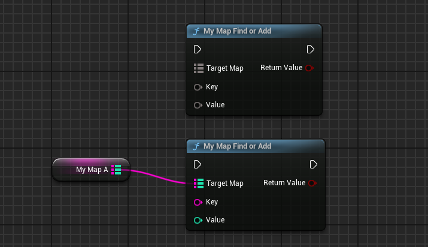

# MapParam

- **功能描述：** 指定一个函数为使用TMap<TKey,TValue>的函数，元素类型为通配符的泛型。
- **使用位置：** UFUNCTION
- **引擎模块：** Blueprint
- **元数据类型：** string="abc"
- **限制类型：** TMap
- **关联项：** [MapKeyParam](#Meta_Blueprint_Param_MapParam_MapKeyParam), [MapValueParam](#Meta_Blueprint_Param_MapParam_MapValueParam)
- **常用程度：** ★★★

指定一个函数为使用TMap<TKey,TValue>的函数，元素类型为通配符的泛型。

只能支持一个MapParam，源码中的实现是只根据一个名字来FindPin。

在源码中，例子都是在UBlueprintMapLibrary中使用。

## 测试代码1：

```cpp
	UFUNCTION(BlueprintPure, CustomThunk, meta = (MapParam = "TargetMap"))
	static int32 MyMap_Count(const TMap<int32, int32>& TargetMap);
	static int32 GenericMyMap_Count(const void* TargetMap, const FMapProperty* MapProperty);
	DECLARE_FUNCTION(execMyMap_Count);
```

## 蓝图中效果1：


因为只支持一个MapParam，因此如果你书写这种代码 。

## 测试代码2：

```cpp
	UFUNCTION(BlueprintPure, CustomThunk, meta = (MapParam = "MapA,MapB"))
	static int32 MyMap_CompareSize(const TMap<int32, int32>& MapA, const TMap<int32, int32>& MapB);
	static int32 GenericMyMap_CompareSize(void* MapA, const FMapProperty* MapAProp, void* MapB, const FMapProperty* MapBProp);
	DECLARE_FUNCTION(execMyMap_CompareSize);
```

会导致MapParam搜索不到Pin，从而失去通配符的功能。


而如果要实现类似Add的功能，达到Key和Value的Pin类型也可以动态的根据Map的类型而自动的改变。则需要加上MapKeyParam 和MapValueParam 分别的指定另外的函数参数以便能找到正确的Pin，从而实现动态的根据Map类型而更改KeyValue Pin类型。MapKeyParam 和MapValueParam 指定的参数也可以为数组等容器，可以参照UBlueprintMapLibrary中的Keys和Values参数。

```cpp
	UFUNCTION(BlueprintCallable, CustomThunk, meta = (MapParam = "TargetMap",MapKeyParam = "Key", MapValueParam = "Value"))
	static bool MyMap_FindOrAdd(const TMap<int32, int32>& TargetMap, const int32& Key, const int32& Value);
	static bool GenericMyMap_FindOrAdd(const void* TargetMap, const FMapProperty* MapProperty, const void* KeyPtr, const void* ValuePtr);
	DECLARE_FUNCTION(execMyMap_FindOrAdd);
```

## 蓝图中的效果2：



## 原理代码:

```cpp
void UK2Node_CallFunction::ConformContainerPins()
{
		//在这其中检测容器Pin
		const FString& MapPinMetaData = TargetFunction->GetMetaData(FBlueprintMetadata::MD_MapParam);
		const FString& MapKeyPinMetaData = TargetFunction->GetMetaData(FBlueprintMetadata::MD_MapKeyParam);
		const FString& MapValuePinMetaData = TargetFunction->GetMetaData(FBlueprintMetadata::MD_MapValueParam);

		if(!MapPinMetaData.IsEmpty() || !MapKeyPinMetaData.IsEmpty() || !MapValuePinMetaData.IsEmpty() )
		{
			// if the map pin has a connection infer from that, otherwise use the information on the key param and value param:
			bool bReadyToPropagateKeyType = false;
			FEdGraphTerminalType KeyTypeToPropagate;
			bool bReadyToPropagateValueType = false;
			FEdGraphTerminalType ValueTypeToPropagate;

			UEdGraphPin* MapPin = MapPinMetaData.IsEmpty() ? nullptr : FindPin(MapPinMetaData);
			UEdGraphPin* MapKeyPin = MapKeyPinMetaData.IsEmpty() ? nullptr : FindPin(MapKeyPinMetaData);
			UEdGraphPin* MapValuePin = MapValuePinMetaData.IsEmpty() ? nullptr : FindPin(MapValuePinMetaData);

			TryReadTypeToPropagate(MapPin, bReadyToPropagateKeyType, KeyTypeToPropagate);//读取MapPin的Key连接类型
			TryReadValueTypeToPropagate(MapPin, bReadyToPropagateValueType, ValueTypeToPropagate);//读取MapPin上连接的Map Value类型
			TryReadTypeToPropagate(MapKeyPin, bReadyToPropagateKeyType, KeyTypeToPropagate);//读取KeyPin上的连接类型
			TryReadTypeToPropagate(MapValuePin, bReadyToPropagateValueType, ValueTypeToPropagate);//读取ValuePin上的连接类型

			TryPropagateType(MapPin, KeyTypeToPropagate, bReadyToPropagateKeyType);//改变MapPin的Key当前类型
			TryPropagateType(MapKeyPin, KeyTypeToPropagate, bReadyToPropagateKeyType);//改变KeyPin的当前类型

			TryPropagateValueType(MapPin, ValueTypeToPropagate, bReadyToPropagateValueType);//改变MapPin的Value当前类型
			TryPropagateType(MapValuePin, ValueTypeToPropagate, bReadyToPropagateValueType);//改变ValuePin的当前类型
		}
}
```