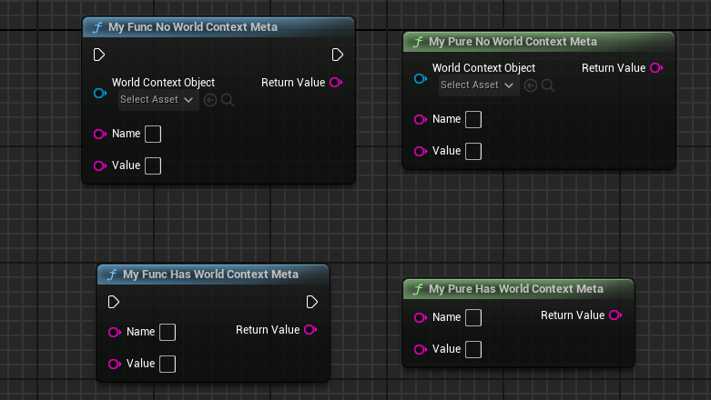
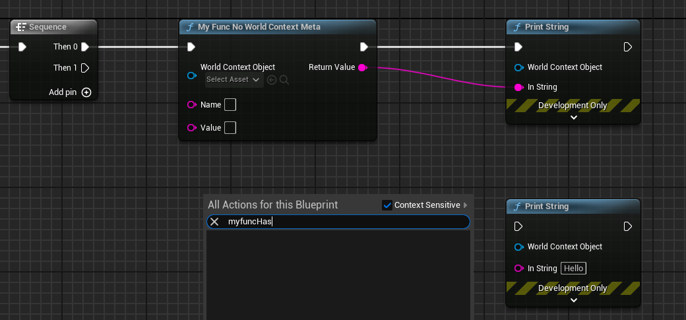

# WorldContext

- **功能描述：** 指定函数的一个参数自动接收WorldContext对象，以便确定当前运行所处于的World
- **使用位置：** UFUNCTION
- **引擎模块：** Blueprint
- **元数据类型：** string="abc"
- **关联项：** [CallableWithoutWorldContext](#Meta_Blueprint_CallableWithoutWorldContext), [ShowWorldContextPin](#Meta_Blueprint_ShowWorldContextPin)
- **常用程度：** ★★★★★

指定函数的一个参数自动接收WorldContext对象，以便确定当前运行所处于的World。函数是BlueprintCallable或BlueprintPure都可以，静态函数或成员函数也都可以。一般情况下是用于函数库里的静态函数，典型的例子是UGameplayStatics中的众多static函数。

```cpp
UFUNCTION(BlueprintPure, Category="Game", meta=(WorldContext="WorldContextObject"))
static ENGINE_API class UGameInstance* GetGameInstance(const UObject* WorldContextObject)
{
		UWorld* World = GEngine->GetWorldFromContextObject(WorldContextObject, EGetWorldErrorMode::LogAndReturnNull);
		return World ? World->GetGameInstance() : nullptr;
}

//在Runtime下获得World的方式一般是：
UWorld* World = GEngine->GetWorldFromContextObject(WorldContextObject, EGetWorldErrorMode::ReturnNull);
//在Editor下(如CallInEditor函数)获得World的方式一般是：
UObject* WorldContextObject = EditorEngine->GetEditorWorldContext().World();
```

## 测试代码：

```cpp
UCLASS(Blueprintable, BlueprintType)
class INSIDER_API UMyFunctionLibrary_WorldContextTest :public UBlueprintFunctionLibrary
{
public:
	GENERATED_BODY()
public:
	UFUNCTION(BlueprintCallable)
	static FString MyFunc_NoWorldContextMeta(const UObject* WorldContextObject, FString name, FString value);

	UFUNCTION(BlueprintCallable, meta = (WorldContext = "WorldContextObject"))
	static FString MyFunc_HasWorldContextMeta(const UObject* WorldContextObject, FString name, FString value);

	UFUNCTION(BlueprintPure)
	static FString MyPure_NoWorldContextMeta(const UObject* WorldContextObject, FString name, FString value);

	UFUNCTION(BlueprintPure, meta = (WorldContext = "WorldContextObject"))
	static FString MyPure_HasWorldContextMeta(const UObject* WorldContextObject, FString name, FString value);
};

UCLASS(Blueprintable, BlueprintType)
class INSIDER_API UMyObject_NoGetWorld :public UObject
{
	GENERATED_BODY()
};

UCLASS(Blueprintable, BlueprintType)
class INSIDER_API UMyObject_HasGetWorld :public UObject
{
	GENERATED_BODY()

	UWorld* WorldPrivate = nullptr;
public:
	UFUNCTION(BlueprintCallable)
	void RegisterWithOuter()
	{
		if (UObject* outer = GetOuter())
		{
			WorldPrivate = outer->GetWorld();
		}
	}

	virtual UWorld* GetWorld() const override final { return WorldPrivate; }
};

//.cpp

FString UMyFunctionLibrary_WorldContextTest::MyFunc_HasWorldContextMeta(const UObject* WorldContextObject, FString name, FString value)
{
	UWorld* World = GEngine->GetWorldFromContextObject(WorldContextObject, EGetWorldErrorMode::LogAndReturnNull);
	if (World != nullptr)
	{
		return WorldContextObject->GetName();
	}
	return TEXT("None");
}

FString UMyFunctionLibrary_WorldContextTest::MyFunc_NoWorldContextMeta(const UObject* WorldContextObject, FString name, FString value)
{
	return MyFunc_HasWorldContextMeta(WorldContextObject, name, value);
}

FString UMyFunctionLibrary_WorldContextTest::MyPure_NoWorldContextMeta(const UObject* WorldContextObject, FString name, FString value)
{
	return MyFunc_HasWorldContextMeta(WorldContextObject, name, value);
}

FString UMyFunctionLibrary_WorldContextTest::MyPure_HasWorldContextMeta(const UObject* WorldContextObject, FString name, FString value)
{
	return MyFunc_HasWorldContextMeta(WorldContextObject, name, value);
}
```

## 蓝图中的测试效果：

在Actor中调用，可以发现没指定WorldContext 的函数，会暴露出这个Object参数，让你必须手动指定。而带上WorldContext 的函数，则默认隐藏了起来WorldContextObject参数，因为WorldContextObject对象在Actor中可以自动被赋值（其值就是当前Actor)。



在UMyObject_NoGetWorld的子类里，因为并没有实现GetWorld，因此无法获得World，从而没办法自动赋值WorldContextObject，所以并不能调用出MyFunc_HasWorldContextMeta。



而在UMyObject_HasGetWorld的子类中调用，因为UMyObject_HasGetWorld实现了GetWorld，因此就可以允许调用MyFunc_HasWorldContextMeta，其WorldContextObject的值为UMyObject_HasGetWorld子类对象，在其身上会调用GetWorld()，从而获得之前注册进去的WorldPrivate对象。


## 原理：

当一个函数需要和World产生交互，而这个函数（通常是static函数）又无法直接寻找到World对象的时候，需要在函数的参数上手动从外部传入一个额外参数，根据这个参数来顺藤摸瓜寻到OuterWorld。这个参数就叫做WorldContextObject，一般是UObject*类型，方便传入各种类型的对象。

这个WorldContextObject你可以手动传入。也可以自动被赋值，只要这个Object类实现了virutal GetWorld()接口并且不返回nullptr，就可以正常的获得World对象，从而可以同runtime游戏世界产生交互。

在平常的使用过程中，我们的蓝图对象大部分已经是知道自身处于哪个World的，比如Actor肯定就知道自己属于哪个World。

```cpp
UWorld* AActor::GetWorld() const
{
	// CDO objects do not belong to a world
	// If the actors outer is destroyed or unreachable we are shutting down and the world should be nullptr
	if (!HasAnyFlags(RF_ClassDefaultObject) && ensureMsgf(GetOuter(), TEXT("Actor: %s has a null OuterPrivate in AActor::GetWorld()"), *GetFullName())
		&& !GetOuter()->HasAnyFlags(RF_BeginDestroyed) && !GetOuter()->IsUnreachable())
	{
		if (ULevel* Level = GetLevel())
		{
			return Level->OwningWorld;
		}
	}
	return nullptr;
}
```

在这种Actor内部调用static函数，如果每次还得手动设置WorldContextObject就显得麻烦又有点明知故问了。因此WorldContext这个meta就指定蓝图系统自动为我们的WorldContextObject赋值，其值就是该Actor本身，省去了我们手动传参的麻烦，又隐藏了这个与业务逻辑无关的功能胶水参数，看起来优雅一些。

而如果是在普通的Object对象内部调用函数，则不知道其所属于哪个World。这个时候就需要这个Object类实现了GetWorld()。编辑器下用bGetWorldOverridden这个变量来判断一个UObject子类是否已经覆盖了GetWorld。如果子类有覆盖，在探测的时候，只要在CDO上调用一下ImplementsGetWorld就可以获得bGetWorldOverridden==true的结果，结果就可以允许自动指定WorldContextObject的函数版本被调用。稍微多提一下，bGetWorldOverridden 不是UObject成员变量，其只是在ImplementsGetWorld()调用的时用到的临时变量，因此不需要保存。

```cpp
#if DO_CHECK || WITH_EDITOR
// Used to check to see if a derived class actually implemented GetWorld() or not
thread_local bool bGetWorldOverridden = false;
#endif // #if DO_CHECK || WITH_EDITOR

class UWorld* UObject::GetWorld() const
{
	if (UObject* Outer = GetOuter())
	{
		return Outer->GetWorld();
	}

#if DO_CHECK || WITH_EDITOR
	bGetWorldOverridden = false;
#endif
	return nullptr;
}

#if WITH_EDITOR

bool UObject::ImplementsGetWorld() const
{
	bGetWorldOverridden = true;
	GetWorld();
	return bGetWorldOverridden;
}

#endif // #if WITH_EDITOR
```

更进一步解释，在静态蓝图函数上（BPTYPE_FunctionLibrary里的函数，或者为FUNC_Static的函数）都有一个隐藏的参数“__WorldContext”，在UK2Node_CallFunction的ExpandNode的时候，会把__WorldContext上的值，赋值给DefaultToSelf或WorldContext则两个Meta标签指定的函数参数，从而实现自动把Self赋值到DefaultToSelf和WorldContext。

```cpp
void UK2Node_CallFunction::ExpandNode(class FKismetCompilerContext& CompilerContext, UEdGraph* SourceGraph)

else if (UEdGraphPin* BetterSelfPin = EntryPoints[0]->GetAutoWorldContextPin())
{
	const FString& DefaultToSelfMetaValue = Function->GetMetaData(FBlueprintMetadata::MD_DefaultToSelf);
	const FString& WorldContextMetaValue = Function->GetMetaData(FBlueprintMetadata::MD_WorldContext);

	struct FStructConnectHelper
	{
		static void Connect(const FString& PinName, UK2Node* Node, UEdGraphPin* BetterSelf, const UEdGraphSchema_K2* InSchema, FCompilerResultsLog& MessageLog)
		{
			UEdGraphPin* Pin = Node->FindPin(PinName);
			if (!PinName.IsEmpty() && Pin && !Pin->LinkedTo.Num())
			{
				const bool bConnected = InSchema->TryCreateConnection(Pin, BetterSelf);
				if (!bConnected)
				{
					MessageLog.Warning(*LOCTEXT("DefaultToSelfNotConnected", "DefaultToSelf pin @@ from node @@ cannot be connected to @@").ToString(), Pin, Node, BetterSelf);
				}
			}
		}
	};
	FStructConnectHelper::Connect(DefaultToSelfMetaValue, this, BetterSelfPin, Schema, CompilerContext.MessageLog);
	if (!Function->HasMetaData(FBlueprintMetadata::MD_CallableWithoutWorldContext))
	{
		FStructConnectHelper::Connect(WorldContextMetaValue, this, BetterSelfPin, Schema, CompilerContext.MessageLog);
	}
}
```