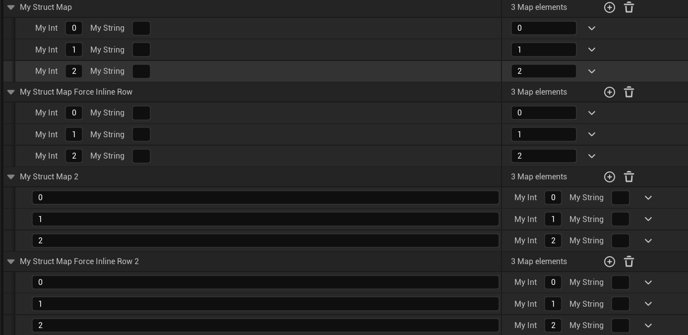

# ForceInlineRow

- **功能描述：** 强制TMap属性里的结构key和其他Value合并到同一行来显示
- **使用位置：** UPROPERTY
- **元数据类型：** bool
- **关联项：** [EditInline](#Meta_DetailsPanel_EditInline)
- **常用程度：** ★

强制TMap属性里的结构key和其他Value合并到同一行来显示。这里要注意的点是：

- 本属性是TMap属性，这样才有Key。TArray或TSet是没有用的。
- FStruct作为Key，这样源码里的机制才能生效，因为判断的就是Key Property
- 该FStruct有注册相关的IPropertyTypeCustomization，这样才能自定义该结构的显示UI
- 该IPropertyTypeCustomization的ShouldInlineKey返回false（默认就是），否则true的话则不管有没有标ForceInlineRow，都会合并成一行

## 测试代码：

```cpp
public:
	UPROPERTY(EditAnywhere, BlueprintReadWrite)
	TMap<FMyCommonStruct, int32> MyStructMap;

	UPROPERTY(EditAnywhere, BlueprintReadWrite, meta = (ForceInlineRow))
	TMap<FMyCommonStruct, int32> MyStructMap_ForceInlineRow;

	UPROPERTY(EditAnywhere, BlueprintReadWrite)
	TMap<int32, FMyCommonStruct> MyStructMap2;

	UPROPERTY(EditAnywhere, BlueprintReadWrite, meta = (ForceInlineRow))
	TMap<int32, FMyCommonStruct> MyStructMap_ForceInlineRow2;


void FMyCommonStructCustomization::CustomizeHeader(TSharedRef<IPropertyHandle> PropertyHandle, FDetailWidgetRow& HeaderRow, IPropertyTypeCustomizationUtils& CustomizationUtils)
{
	HeaderRow.NameContent()[SNew(STextBlock).Text(INVTEXT("This is MyCommonStruct"))];

	TSharedPtr<IPropertyHandle> IntPropertyHandle = PropertyHandle->GetChildHandle(GET_MEMBER_NAME_CHECKED(FMyCommonStruct, MyInt));
	TSharedPtr<IPropertyHandle> StringPropertyHandle = PropertyHandle->GetChildHandle(GET_MEMBER_NAME_CHECKED(FMyCommonStruct, MyString));

	HeaderRow.ValueContent()
		[
			SNew(SHorizontalBox)
				+ SHorizontalBox::Slot()
				.Padding(5.0f, 0.0f).AutoWidth()
				[
					IntPropertyHandle->CreatePropertyNameWidget()
				]
				+ SHorizontalBox::Slot()
				.Padding(5.0f, 0.0f).AutoWidth()
				[
					IntPropertyHandle->CreatePropertyValueWidget()
				]
				+ SHorizontalBox::Slot()
				.Padding(5.0f, 0.0f).AutoWidth()
				[
					StringPropertyHandle->CreatePropertyNameWidget()
				]
				+ SHorizontalBox::Slot()
				.Padding(5.0f, 0.0f).AutoWidth()
				[
					StringPropertyHandle->CreatePropertyValueWidget()
				]
		];

}
```

## 测试效果：

可以见到MyStructMap的数据项展示就分为了两行。而带有ForceInlineRow之后，数据项UI就合并为一行，显得更加的简洁。

在下面也特别观察到如果把FStruct作为Value，则是没有这个区别的。


假如不注册FMyCommonStruct相应的IPropertyTypeCustomization的话，则结构的属性UI采用默认方式显示，则都是分为两行。


而假如FMyCommonStruct的IPropertyTypeCustomization的ShouldInlineKey返回true，则会导致即使没有ForceInlineRow也会把该拥有该结构作为Key的属性给都合并为一行显示，这个时候就失去ForceInlineRow的作用和区别了。



## 原理：

该部分逻辑也同样处于在FDetailPropertyRow的构造函数创建过程中，判断是否有GetPropertyKeyNode，则其实是在要求TMap属性。

接着作为Key的类型，如果是UObject*，则因为NeedsKeyNode一直返回false，则无论如何都会进入MakePropertyEditor的分支。

因此此项测试的类型其实是Struct，这样就必须依赖bInlineRow 和FoundPropertyCustomisation 的配合。这个时候就必须有IPropertyTypeCustomization才会进入分支，而且如果IPropertyTypeCustomization::ShouldInlineKey()返回true，则就不管属性上的ForceInlineRow如何，都会进入分支。否则就靠属性上的ForceInlineRow，这个时候才是这个Meta发挥作用的时候。

```cpp
FDetailPropertyRow::FDetailPropertyRow(TSharedPtr<FPropertyNode> InPropertyNode, TSharedRef<FDetailCategoryImpl> InParentCategory, TSharedPtr<FComplexPropertyNode> InExternalRootNode)
{
	if (PropertyNode->GetPropertyKeyNode().IsValid())
	{
		TSharedPtr<IPropertyTypeCustomization> FoundPropertyCustomisation = GetPropertyCustomization(PropertyNode->GetPropertyKeyNode().ToSharedRef(), ParentCategory.Pin().ToSharedRef());

		bool bInlineRow = FoundPropertyCustomisation != nullptr ? FoundPropertyCustomisation->ShouldInlineKey() : false;

		static FName InlineKeyMeta("ForceInlineRow");
		bInlineRow |= InPropertyNode->GetParentNode()->GetProperty()->HasMetaData(InlineKeyMeta);

		// Only create the property editor if it's not a struct or if it requires to be inlined (and has customization)
		if (!NeedsKeyNode(PropertyNodeRef, InParentCategory) || (bInlineRow && FoundPropertyCustomisation != nullptr))
		{
			CachedKeyCustomTypeInterface = FoundPropertyCustomisation;

			MakePropertyEditor(PropertyNode->GetPropertyKeyNode().ToSharedRef(), Utilities, PropertyKeyEditor);
		}
	}
}

bool FDetailPropertyRow::NeedsKeyNode(TSharedRef<FPropertyNode> InPropertyNode, TSharedRef<FDetailCategoryImpl> InParentCategory)
{
	FStructProperty* KeyStructProp = CastField<FStructProperty>(InPropertyNode->GetPropertyKeyNode()->GetProperty());
	return KeyStructProp != nullptr;
}
```

源码里使用的例子：

在源码里搜索发现到该例子，但实际上其实这里HLODSetups上的ForceInlineRow并不能起作用。

```cpp
USTRUCT()
struct FRuntimePartitionDesc
{
	GENERATED_USTRUCT_BODY()

#if WITH_EDITORONLY_DATA
	/** Partition class */
	UPROPERTY(EditAnywhere, Category = RuntimeSettings)
	TSubclassOf<URuntimePartition> Class;

	/** Name for this partition, used to map actors to it through the Actor.RuntimeGrid property  */
	UPROPERTY(EditAnywhere, Category = RuntimeSettings, Meta = (EditCondition = "Class != nullptr", HideEditConditionToggle))
	FName Name;

	/** Main partition object */
	UPROPERTY(VisibleAnywhere, Category = RuntimeSettings, Instanced, Meta = (EditCondition = "Class != nullptr", HideEditConditionToggle, NoResetToDefault, TitleProperty = "Name"))
	TObjectPtr<URuntimePartition> MainLayer;

	/** HLOD setups used by this partition, one for each layers in the hierarchy */
	UPROPERTY(EditAnywhere, Category = RuntimeSettings, Meta = (EditCondition = "Class != nullptr", HideEditConditionToggle, ForceInlineRow))
	TArray<FRuntimePartitionHLODSetup> HLODSetups;
#endif

#if WITH_EDITOR
	void UpdateHLODPartitionLayers();
#endif
};
```