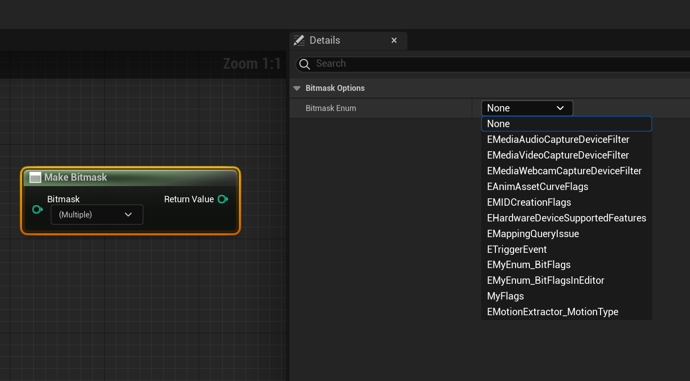

# Bitflags

- **功能描述：** 设定一个枚举支持采用位标记赋值，从而在蓝图中可以识别出来是BitMask
- **使用位置：** UENUM
- **引擎模块：** Enum Property
- **元数据类型：** bool
- **关联项：** [UseEnumValuesAsMaskValuesInEditor](#Meta_Enum_UseEnumValuesAsMaskValuesInEditor)
- **常用程度：** ★★★★★

常常和UPROPERTY上的bitmask一起配合使用。

注意这个和UENUM(flags)的区别，后者是影响C++里字符串输出函数。

这个是指定该枚举支持位标记，从而在蓝图中可以被选择出来。

```cpp
UENUM(BlueprintType,Flags)
enum class EMyEnum_Flags:uint8
{
	First,
	Second,
	Third,
};
UENUM(BlueprintType,Meta = (Bitflags))
enum class EMyEnum_BitFlags:uint8
{
	First,
	Second,
	Third,
};

//源码中的例子：
UENUM(Meta = (Bitflags))
enum class EColorBits
{
ECB_Red,
ECB_Green,
ECB_Blue
};
UPROPERTY(EditAnywhere, Meta = (Bitmask, BitmaskEnum = "EColorBits"))
int32 ColorFlags;
```

如下图所示：EMyEnum_Flags就不会被列在选项里。而EMyEnum_BitFlags就可以被列进来。



如果没有UPROPERTY(bitmask)的配合使用，则蓝图里还是只能单项选择

