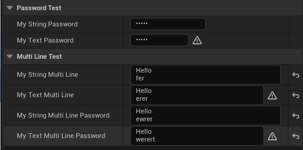

# MultiLine

- **功能描述：** 使得文本属性编辑框支持换行。
- **使用位置：** UPROPERTY
- **引擎模块：** String/Text Property
- **元数据类型：** bool
- **限制类型：** FName/FString/Fext
- **常用程度：** ★★★★★

使得文本属性编辑框支持换行。换行后的字符串以”\r\n”分隔换行。

## 测试代码：

```cpp
	UPROPERTY(EditAnywhere, Category = MultiLineTest, meta = (MultiLine = true))
	FString MyString_MultiLine = TEXT("Hello");

	UPROPERTY(EditAnywhere, Category = MultiLineTest, meta = (MultiLine = true))
	FText MyText_MultiLine = INVTEXT("Hello");

	UPROPERTY(EditAnywhere, Category = MultiLineTest, meta = (MultiLine = true, PasswordField = true))
	FString MyString_MultiLine_Password = TEXT("Hello");

	UPROPERTY(EditAnywhere, Category = MultiLineTest, meta = (MultiLine = true, PasswordField = true))
	FText MyText_MultiLine_Password  = INVTEXT("Hello");
```

## 测试结果：

按住Shift+Enter回车换行。



## 原理：

原理也很简单，根据bIsMultiLine 创建特定的多行编辑控件SMultiLineEditableTextBox。

```cpp
void SPropertyEditorText::Construct( const FArguments& InArgs, const TSharedRef< class FPropertyEditor >& InPropertyEditor )
{
bIsMultiLine = PropertyHandle->GetBoolMetaData(NAME_MultiLine);

		if(bIsMultiLine)
		{
			ChildSlot
			[
				SAssignNew(HorizontalBox, SHorizontalBox)
				+SHorizontalBox::Slot()
				.FillWidth(1.0f)
				[
					SAssignNew(MultiLineWidget, SMultiLineEditableTextBox)
					.Text(InPropertyEditor, &FPropertyEditor::GetValueAsText)
					.Font(InArgs._Font)
					.SelectAllTextWhenFocused(false)
					.ClearKeyboardFocusOnCommit(false)
					.OnTextCommitted(this, &SPropertyEditorText::OnTextCommitted)
					.OnVerifyTextChanged(this, &SPropertyEditorText::OnVerifyTextChanged)
					.SelectAllTextOnCommit(false)
					.IsReadOnly(this, &SPropertyEditorText::IsReadOnly)
					.AutoWrapText(true)
					.ModiferKeyForNewLine(EModifierKey::Shift)
					//.IsPassword( bIsPassword )
				]
			];

			PrimaryWidget = MultiLineWidget;
		}

}
```