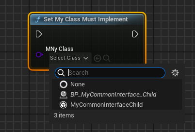

# MustImplement

- **功能描述：** 指定TSubClassOf或FSoftClassPath属性选择的类必须实现该接口
- **使用位置：** UPROPERTY
- **引擎模块：** TypePicker
- **元数据类型：** string="abc"
- **限制类型：** TSubClassOf, FSoftClassPath，UClass*
- **常用程度：** ★★★

指定TSubClassOf或FSoftClassPath属性选择的类必须实现该接口。

- TSubClassOf，FSoftClassPath，还有原始的UClass*属性都可以用来找到一个UClass*，区别是UClass*是硬引用到一个具体的类对象，而FSoftClassPath是软引用到类对象的路径，不过这二者都是泛泛的UClass*，并没有对子类型进行约束。而TSubClassOf<T>虽然也是硬引用类对象，但是进一步把类型的选择范围限制到了T的子类上，在很多时候会更加的便利，特别是你已经知道你的子类范围。比如TSubClassOf<AActor>或TSubClassOf<UUserWidget>。
- 在这种用于选择Class的属性上，如果不进行限制则会把引擎里的所有类都找出来让你选择，不是那么便利。
- 因此引擎里增加了一些进一步筛选的机制。MustImplement就是用于筛选指定class属性必须实现某个接口。

## 测试代码：

```cpp
UCLASS(BlueprintType)
class INSIDER_API UMyCommonInterfaceChild :public UObject, public IMyCommonInterface
{
	GENERATED_BODY()
};

UPROPERTY(EditAnywhere, BlueprintReadWrite, Category = "MustImplementTest|TSubclassOf")
TSubclassOf<UObject> MyClass_NoMustImplement;

UPROPERTY(EditAnywhere, BlueprintReadWrite, Category = "MustImplementTest|TSubclassOf", meta = (MustImplement = "MyCommonInterface"))
TSubclassOf<UObject> MyClass_MustImplement;

UPROPERTY(EditAnywhere, BlueprintReadWrite, Category = "MustImplementTest|TSubclassOf", meta = (MustImplement = "/Script/UMG.UserListEntry"))
TSubclassOf<UUserWidget> MyWidgetClass_MustImplement;

UPROPERTY(EditAnywhere, BlueprintReadWrite, Category = "MustImplementTest|FSoftClassPath")
FSoftClassPath MySoftClass_NoMustImplement;

UPROPERTY(EditAnywhere, BlueprintReadWrite, Category = "MustImplementTest|FSoftClassPath", meta = (MustImplement = "MyCommonInterface"))
FSoftClassPath MySoftClass_MustImplement;

UPROPERTY(EditAnywhere, BlueprintReadWrite, Category = "MustImplementTest|FSoftClassPath", meta = (MustImplement = "/Script/UMG.UserListEntry"))
FSoftClassPath MySoftWidgetClass_MustImplement;

UPROPERTY(EditAnywhere, BlueprintReadWrite, Category = "MustImplementTest|UClass*")
UClass* MyClassStar_NoMustImplement;

UPROPERTY(EditAnywhere, BlueprintReadWrite, Category = "MustImplementTest|UClass*", meta = (MustImplement = "MyCommonInterface"))
UClass* MyClassStar_MustImplement;

UPROPERTY(EditAnywhere, BlueprintReadWrite, Category = "MustImplementTest|UClass*", meta = (MustImplement = "/Script/UMG.UserListEntry"))
UClass* MyWidgetClassStar_MustImplement;

UFUNCTION(BlueprintCallable, meta=(Category="MustImplementTest|TSubclassOf"))
static void SetMyClassMustImplement(UPARAM(meta=(MustImplement="MyCommonInterface")) TSubclassOf<UObject> MNyClass){}
```

## 测试效果：

可以发现第一个没有筛选的结果，第二和第三个有了筛选后的结果。


也可以放在在函数里作为参数：



## 原理：

在FPropertyHandleBase生成可能值的时候，可以看到做了一系列的筛选。

```cpp

void FSoftClassPathCustomization::CustomizeHeader(TSharedRef<IPropertyHandle> InPropertyHandle, FDetailWidgetRow& HeaderRow, IPropertyTypeCustomizationUtils& StructCustomizationUtils)
{
	PropertyHandle = InPropertyHandle;

	const FString& MetaClassName = PropertyHandle->GetMetaData("MetaClass");
	const FString& RequiredInterfaceName = PropertyHandle->GetMetaData("RequiredInterface"); // This was the old name, switch to MustImplement to synchronize with class property
	const FString& MustImplementName = PropertyHandle->GetMetaData("MustImplement");
	TArray<const UClass*> AllowedClasses = PropertyCustomizationHelpers::GetClassesFromMetadataString(PropertyHandle->GetMetaData("AllowedClasses"));
	TArray<const UClass*> DisallowedClasses = PropertyCustomizationHelpers::GetClassesFromMetadataString(PropertyHandle->GetMetaData("DisallowedClasses"));
	const bool bAllowAbstract = PropertyHandle->HasMetaData("AllowAbstract");
	const bool bIsBlueprintBaseOnly = PropertyHandle->HasMetaData("IsBlueprintBaseOnly") || PropertyHandle->HasMetaData("BlueprintBaseOnly");
	const bool bAllowNone = !(PropertyHandle->GetMetaDataProperty()->PropertyFlags & CPF_NoClear);
	const bool bShowTreeView = PropertyHandle->HasMetaData("ShowTreeView");
	const bool bHideViewOptions = PropertyHandle->HasMetaData("HideViewOptions");
	const bool bShowDisplayNames = PropertyHandle->HasMetaData("ShowDisplayNames");

	const UClass* const MetaClass = !MetaClassName.IsEmpty()
		? FEditorClassUtils::GetClassFromString(MetaClassName)
		: UObject::StaticClass();
	const UClass* const RequiredInterface = !RequiredInterfaceName.IsEmpty()
		? FEditorClassUtils::GetClassFromString(RequiredInterfaceName)
		: FEditorClassUtils::GetClassFromString(MustImplementName);
}

TSharedRef<SWidget> SGraphPinClass::GenerateAssetPicker()
{
		if (UEdGraphNode* ParentNode = GraphPinObj->GetOwningNode())
		{
			FString PossibleInterface = ParentNode->GetPinMetaData(GraphPinObj->PinName, TEXT("MustImplement"));
			if (!PossibleInterface.IsEmpty())
			{
				Filter->RequiredInterface = UClass::TryFindTypeSlow<UClass>(PossibleInterface);
			}
		}

}

bool FPropertyHandleBase::GeneratePossibleValues(TArray<FString>& OutOptionStrings, TArray< FText >& OutToolTips, TArray<bool>& OutRestrictedItems, TArray<FText>* OutDisplayNames)
{
	 if( Property->IsA(FClassProperty::StaticClass()) || Property->IsA(FSoftClassProperty::StaticClass()) )
	{
		UClass* MetaClass = Property->IsA(FClassProperty::StaticClass())
			? CastFieldChecked<FClassProperty>(Property)->MetaClass
			: CastFieldChecked<FSoftClassProperty>(Property)->MetaClass;

		FString NoneStr( TEXT("None") );
		OutOptionStrings.Add( NoneStr );
		if (OutDisplayNames)
		{
			OutDisplayNames->Add(FText::FromString(NoneStr));
		}

		const bool bAllowAbstract = Property->GetOwnerProperty()->HasMetaData(TEXT("AllowAbstract"));
		const bool bBlueprintBaseOnly = Property->GetOwnerProperty()->HasMetaData(TEXT("BlueprintBaseOnly"));
		const bool bAllowOnlyPlaceable = Property->GetOwnerProperty()->HasMetaData(TEXT("OnlyPlaceable"));
		UClass* InterfaceThatMustBeImplemented = Property->GetOwnerProperty()->GetClassMetaData(TEXT("MustImplement"));

		if (!bAllowOnlyPlaceable || MetaClass->IsChildOf<AActor>())
		{
			for (TObjectIterator<UClass> It; It; ++It)
			{
				if (It->IsChildOf(MetaClass)
					&& PropertyEditorHelpers::IsEditInlineClassAllowed(*It, bAllowAbstract)
					&& (!bBlueprintBaseOnly || FKismetEditorUtilities::CanCreateBlueprintOfClass(*It))
					&& (!InterfaceThatMustBeImplemented || It->ImplementsInterface(InterfaceThatMustBeImplemented))
					&& (!bAllowOnlyPlaceable || !It->HasAnyClassFlags(CLASS_Abstract | CLASS_NotPlaceable)))
				{
					OutOptionStrings.Add(It->GetName());
					if (OutDisplayNames)
					{
						OutDisplayNames->Add(FText::FromString(It->GetName()));
					}
				}
			}
		}
	}
}
```