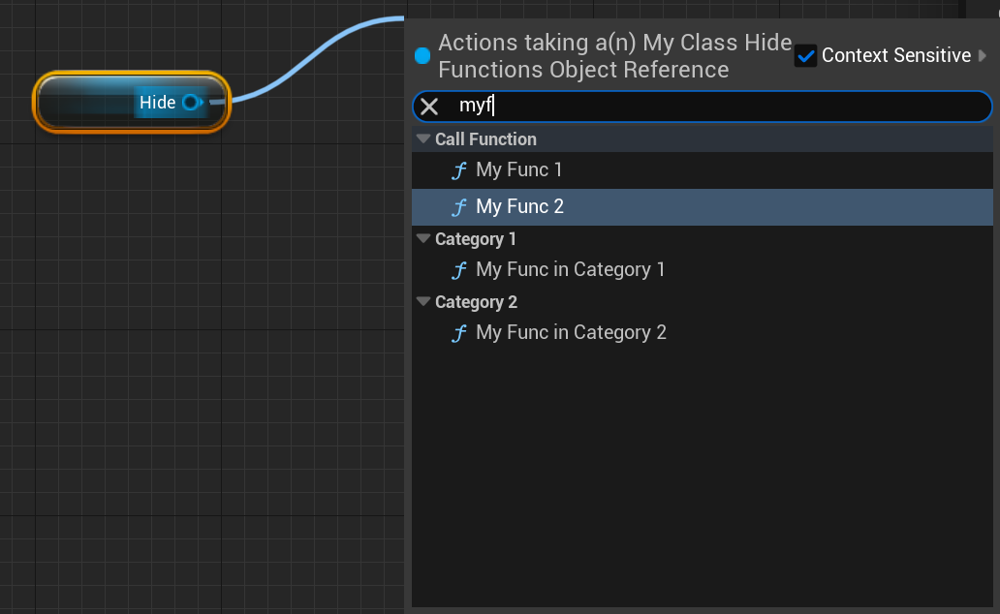

# HideFunctions

- **功能描述：** 在子类的函数覆盖列表里隐藏掉某些函数。
- **引擎模块：** Blueprint
- **元数据类型：** strings=(abc，"d|e"，"x|y|z")
- **作用机制：** 在Meta中增加[HideFunctions](#Meta_Blueprint_HideFunctions)
- **关联项：** [ShowFunctions](#Specifier_UCLASS_Blueprint_ShowFunctions)
- **常用程度：** ★★

在子类的函数覆盖列表里隐藏掉某些函数。

- 在蓝图中鼠标右键依然可以查看到该类下BlueprintCallable的函数，依然可以调用，本标记只是用在类的函数覆盖列表上。
- HideFunctions其实只能填函数名字，想要隐藏一个目录下的函数，是需要HideCategories再额外定义的。

源码中只有一个地方用到，一个很好的示例是UCameraComponent中定义的SetFieldOfView和SetAspectRatio，对UCineCameraComponent 来说是无意义的，因此隐藏掉会更好。

```cpp
class ENGINE_API UCameraComponent : public USceneComponent
{
UFUNCTION(BlueprintCallable, Category = Camera)
	virtual void SetFieldOfView(float InFieldOfView) { FieldOfView = InFieldOfView; }
UFUNCTION(BlueprintCallable, Category = Camera)
	void SetAspectRatio(float InAspectRatio) { AspectRatio = InAspectRatio; }
}

UCLASS(HideCategories = (CameraSettings), HideFunctions = (SetFieldOfView, SetAspectRatio), Blueprintable, ClassGroup = Camera, meta = (BlueprintSpawnableComponent), Config = Engine)
class CINEMATICCAMERA_API UCineCameraComponent : public UCameraComponent
```

## 示例代码：

```cpp
UCLASS(Blueprintable, HideFunctions = (MyFunc1, MyEvent2),hideCategories= EventCategory2)
class INSIDER_API AMyClass_HideFunctions :public AActor
{
	GENERATED_BODY()
public:
	UFUNCTION(BlueprintCallable)
		void MyFunc1() {}

	UFUNCTION(BlueprintCallable)
		void MyFunc2() {}

	UFUNCTION(BlueprintCallable, Category = "FuncCategory1")
		void MyFuncInCategory1() {}

	UFUNCTION(BlueprintCallable, Category = "FuncCategory2")
		void MyFuncInCategory2() {}

public:
UFUNCTION(BlueprintImplementableEvent)
		void MyEvent1();

	UFUNCTION(BlueprintImplementableEvent)
		void MyEvent2();

	UFUNCTION(BlueprintImplementableEvent, Category = "EventCategory1")
		void MyEventInCategory1();

	UFUNCTION(BlueprintImplementableEvent, Category = "EventCategory2")
		void MyEventInCategory2();
};

UCLASS(Blueprintable, ShowFunctions = (MyEvent2),showCategories= EventCategory2)
class INSIDER_API AMyClass_ShowFunctions :public AMyClass_HideFunctions
{
	GENERATED_BODY()
public:

};
```

## 示例效果：

发现Callable的函数是依然可以调用的。



在HideFunction子类里，函数重载会发现少两个


在ShowFunction的子类里可以重新打开Event2和EventCategory2


## 原理：

原理显示，HideFunctions其实只能填函数名字，想要隐藏一个目录下的函数，是需要HideCategories再额外定义的。

```cpp
bool IsFunctionHiddenFromClass( const UFunction* InFunction,const UClass* Class )
	{
		bool bResult = false;
		if( InFunction )
		{
			bResult = Class->IsFunctionHidden( *InFunction->GetName() );

			static const FName FunctionCategory(TEXT("Category")); // FBlueprintMetadata::MD_FunctionCategory
			if( !bResult && InFunction->HasMetaData( FunctionCategory ) )
			{
				FString const& FuncCategory = InFunction->GetMetaData(FunctionCategory);
				bResult = FEditorCategoryUtils::IsCategoryHiddenFromClass(Class, FuncCategory);
			}
		}
		return bResult;
	}
```