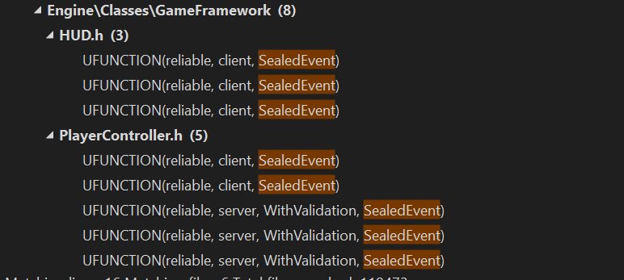

# SealedEvent

- **功能描述：** 无法在子类中覆盖此函数。SealedEvent关键词只能用于事件。对于非事件函数，请将它们声明为static或final，以密封它们。

- **元数据类型：** bool
- **引擎模块：** Behavior
- **作用机制：** 在FunctionFlags中添加[FUNC_Final](#Flags_EFunctionFlags_FUNC_Final)

在源码里搜索：发现都是用在网络的函数上



## UHT中的处理：

```cpp
//先识别符号
[UhtSpecifier(Extends = UhtTableNames.Function, ValueType = UhtSpecifierValueType.Legacy)]
private static void SealedEventSpecifier(UhtSpecifierContext specifierContext)
{
	UhtFunction function = (UhtFunction)specifierContext.Type;
	function.FunctionExportFlags |= UhtFunctionExportFlags.SealedEvent;
}

//再设置标记
// Handle the initial implicit/explicit final
// A user can still specify an explicit final after the parameter list as well.
if (automaticallyFinal || function.FunctionExportFlags.HasAnyFlags(UhtFunctionExportFlags.SealedEvent))
{
				function.FunctionFlags |= EFunctionFlags.Final;
				function.FunctionExportFlags |= UhtFunctionExportFlags.Final | UhtFunctionExportFlags.AutoFinal;
}

再验证：限定只能用在Event上。

if (FunctionExportFlags.HasAnyFlags(UhtFunctionExportFlags.SealedEvent) && !FunctionFlags.HasAnyFlags(EFunctionFlags.Event))
{
	this.LogError("SealedEvent may only be used on events");
}

if (FunctionExportFlags.HasAnyFlags(UhtFunctionExportFlags.SealedEvent) && FunctionFlags.HasAnyFlags(EFunctionFlags.BlueprintEvent))
{
	this.LogError("SealedEvent cannot be used on Blueprint events");
}

```

## 测试代码：

```cpp
//Error: "SealedEvent may only be used on events"
UFUNCTION(SealedEvent)
void MyFunc_SealedEvent() {}

//Error: "SealedEvent cannot be used on Blueprint events"
UFUNCTION(BlueprintCallable,BlueprintImplementableEvent,SealedEvent)
void MyFunc_ImplementableEvent();

//Error: "SealedEvent cannot be used on Blueprint events"
UFUNCTION(BlueprintCallable,BlueprintNativeEvent,SealedEvent)
void MyFunc_NativeEvent();
```

因此无法用于普通的函数，又无法用于蓝图中的Event。所以既是Event又不是BlueprintEvent的是什么？看源码是只有网络的一些函数。

通过对比，发现Sealed函数的区别是多了FUNC_Final的标记。但FUNC_Final又不一定必须要以SealedEvent才能添加，exec或普通的BlueprintCallable函数都会添加。但是如果是vitural的函数就不会添加。在UHT中的原理是：

```cpp
private static UhtParseResult ParseUFunction(UhtParsingScope parentScope, UhtToken token)
{
		if (function.FunctionFlags.HasAnyFlags(EFunctionFlags.Net))
		{
						// Network replicated functions are always events, and are only final if sealed
						scopeName = "event";
						tokenContext.Reset(scopeName);
						automaticallyFinal = false;
		}

		// If virtual, remove the implicit final, the user can still specifying an explicit final at the end of the declaration
		if (function.FunctionExportFlags.HasAnyFlags(UhtFunctionExportFlags.Virtual))
		{
						automaticallyFinal = false;
		}
		// Handle the initial implicit/explicit final
		// A user can still specify an explicit final after the parameter list as well.
		if (automaticallyFinal || function.FunctionExportFlags.HasAnyFlags(UhtFunctionExportFlags.SealedEvent))
		{
						function.FunctionFlags |= EFunctionFlags.Final;
						function.FunctionExportFlags |= UhtFunctionExportFlags.Final | UhtFunctionExportFlags.AutoFinal;
		}

}
```

在自己的C++代码中测试，发现在C++中怎么继承都不会触发编译错误。因此如果想拒绝被继承，还是用C++标准是final关键字。在函数末尾加final。

E:\P4V\Engine\Source\Editor\KismetCompiler\Private\KismetCompiler.cpp

```cpp
const uint32 OverrideFlagsToCheck = (FUNC_FuncOverrideMatch & ~FUNC_AccessSpecifiers);
if ((Context.Function->FunctionFlags & OverrideFlagsToCheck) != (OverridenFunction->FunctionFlags & OverrideFlagsToCheck))
{
	MessageLog.Error(*LOCTEXT("IncompatibleOverrideFlags_Error", "Overriden function is not compatible with the parent function @@. Check flags: Exec, Final, Static.").ToString(), Context.EntryPoint);
}
```

在编译的时候检测的是否是重载父类的函数，但因为SealedEvent不作用于普通函数，也不作用于BlueprintEvent，因此感觉只能在C++中继承。