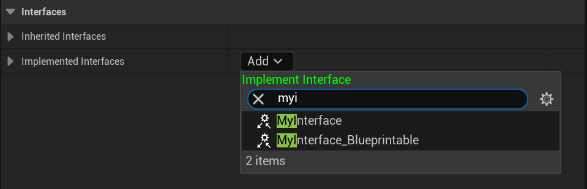

# Blueprintable

- **功能描述：**  可以在蓝图中实现
- **元数据类型：** bool
- **引擎模块：** Blueprint
- **作用机制：** 在Meta中加入[IsBlueprintBase](#Meta_Blueprint_IsBlueprintBase), [BlueprintType](#Meta_Blueprint_BlueprintType)
- **关联项：** [NotBlueprintable](#Specifier_UINTERFACE_Blueprint_NotBlueprintable)
- **常用程度：★★★★★**

是否可以在蓝图中实现。

## 示例代码：

```cpp
UINTERFACE(Blueprintable,MinimalAPI)
class UMyInterface_Blueprintable:public UInterface
{
	GENERATED_UINTERFACE_BODY()
};

class INSIDER_API IMyInterface_Blueprintable
{
	GENERATED_IINTERFACE_BODY()
public:
	UFUNCTION(BlueprintCallable, BlueprintImplementableEvent)
	void Func_ImplementableEvent() const;

	UFUNCTION(BlueprintCallable,BlueprintNativeEvent)
	void Func_NativeEvent() const;
};

UINTERFACE(NotBlueprintable,MinimalAPI)
class UMyInterface_NotBlueprintable:public UInterface
{
	GENERATED_UINTERFACE_BODY()
};

class INSIDER_API IMyInterface_NotBlueprintable
{
	GENERATED_IINTERFACE_BODY()
public:
//也不得定义蓝图函数，因为已经不能在蓝图中实现了
//UFUNCTION(BlueprintCallable, BlueprintImplementableEvent)
	//void Func_ImplementableEvent() const;

//	UFUNCTION(BlueprintCallable,BlueprintNativeEvent)
//	void Func_NativeEvent() const;
};
```

## 示例效果：

在蓝图中测试，发现UMyInterface_NotBlueprintable并不能找到。

