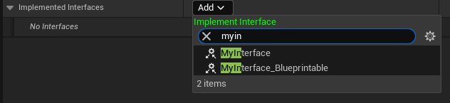

# NotBlueprintable

- **功能描述：**  指定不可以在蓝图中实现
- **元数据类型：** bool
- **引擎模块：** Blueprint
- **作用机制：** 在Meta中去除[IsBlueprintBase](#Meta_Blueprint_IsBlueprintBase)、[BlueprintType](#Meta_Blueprint_BlueprintType)，等价于[CannotImplementInterfaceInBlueprint](#Meta_Blueprint_CannotImplementInterfaceInBlueprint)
- **关联项：** [Blueprintable](#Specifier_UINTERFACE_Blueprint_Blueprintable)
- **常用程度：★★★**

在Class Settings里的Interface里找不到不允许实现的接口。

什么情况下需要用到该标记？虽然不能在蓝图中实现，但是依然可以在C++里实现，也可以通过反射判断一个对象是否实现该接口。